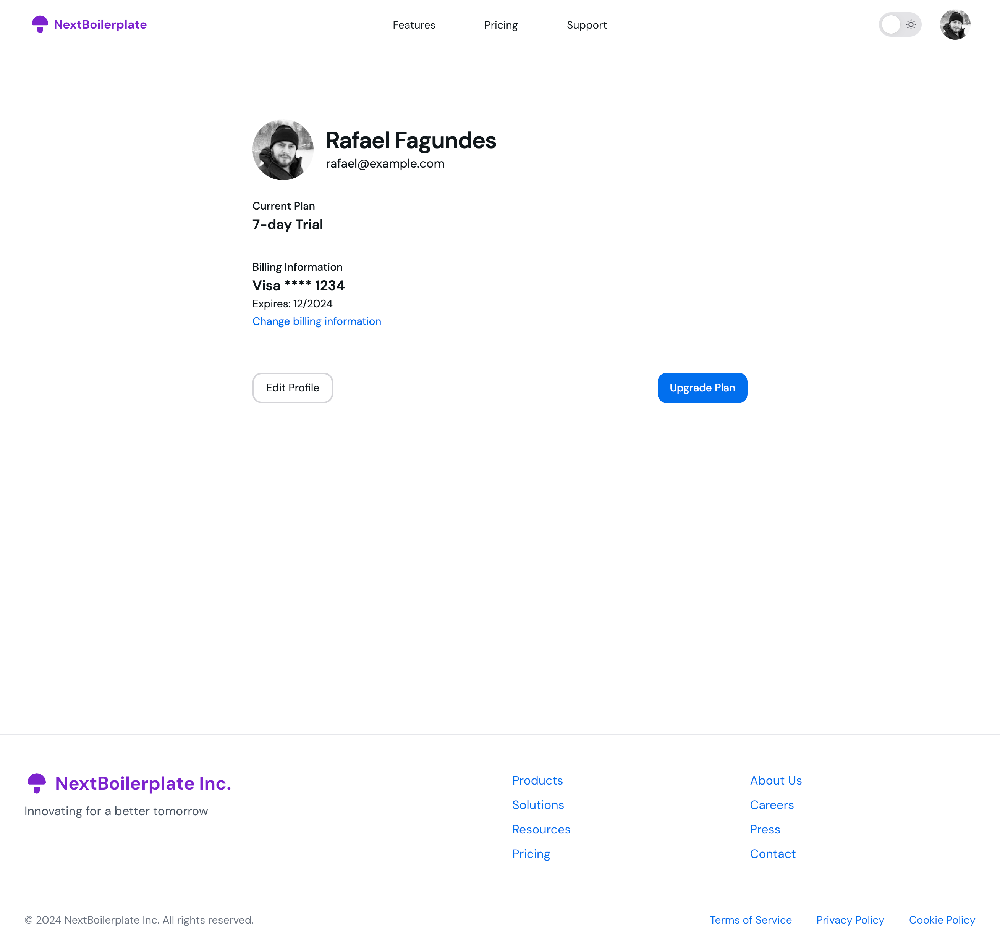

# Next.js Boilerplate

A modern, feature-rich boilerplate for building scalable web applications with Next.js.

## Features 🌟

- [Next.js 14](https://nextjs.org/) with App Router
- [TypeScript](https://www.typescriptlang.org/) for type safety
- [Tailwind CSS](https://tailwindcss.com/) for utility-first styling
- [NextUI](https://nextui.org/) for beautiful, accessible UI components
- [NextAuth.js](https://next-auth.js.org/) for authentication
- [Framer Motion](https://www.framer.com/motion/) for smooth animations
- [Tabler Icons](https://tabler.io/icons) for a comprehensive icon set
- [ESLint](https://eslint.org/) and [Prettier](https://prettier.io/) for code quality
- [Drizzle](https://www.drizzle.org/) for data persistence

## Screenshots 📸

### Home


### Dark Mode


### Features Page


### Pricing Page


### Support Page


### Profile Page


### Sign Up Page


### Login Page


## Getting Started 🚀

1. Clone the repository:

```bash
git clone https://github.com/rafaelfagundes/next-boilerplate.git
cd next-boilerplate
```

2. Install the dependencies:

```bash
npm install
```

3. Set up the environment variables

4. Generate the NextAuth Secret:

```bash
openssl rand -base64 32
```

5. Start the development server:

```bash
npm run dev
```

Open http://localhost:3000 in your browser to see the result.

## Project Structure 📁

src/
├── app/ # App Router pages and layouts
├── components/ # Reusable UI components
├── lib/ # Utility functions and shared logic
├── styles/ # Global styles and Tailwind config
└── types/ # TypeScript type definitions

## Available Scripts 📜

- npm run dev: Start the development server
- npm run build: Build the production application
- npm start: Start the production server
- npm run lint: Run ESLint
- npm run format: Format code with Prettier
- npm run db:migrate: Run database migrations
- npm run db:push: Push database migrations to the database
- npm run db:studio: Open the database migration studio

## VS Code Integration 🛠️

This project includes recommended VS Code extensions for an optimal development experience. To install them:

- Open the Extensions view in VS Code (Ctrl+Shift+X)
- Search for "@recommended" in the extensions search bar
- Install the workspace recommended extensions

## Learn More 📚

To learn more about the technologies used in this boilerplate, check out the following resources:

- [Next.js Documentation](https://nextjs.org/docs) - Learn about Next.js features and API.
- [TypeScript Documentation](https://www.typescriptlang.org/docs/) - Explore TypeScript language features and best practices.
- [Tailwind CSS Documentation](https://tailwindcss.com/docs) - Discover utility-first CSS framework capabilities.
- [NextUI Documentation](https://nextui.org/docs/guide/introduction) - Understand how to use NextUI components effectively.
- [NextAuth.js Documentation](https://next-auth.js.org/getting-started/introduction) - Learn about authentication in Next.js applications.
- [Framer Motion Documentation](https://www.framer.com/motion/) - Explore animation capabilities for React applications.
- [Tabler Icons Documentation](https://tabler.io/icons) - Explore a comprehensive icon set for your projects.
- [Drizzle Documentation](https://www.drizzle.org/docs/getting-started/introduction) - Learn how to use Drizzle for data persistence.
- [ESLint Configuration](https://eslint.org/docs/user-guide/configuring) - Understand how to configure ESLint for your project.
- [ESLint Documentation](https://eslint.org/docs/user-guide/getting-started) - Learn about identifying and fixing problems in your JavaScript code.
- [Prettier Documentation](https://prettier.io/docs/en/index.html) - Understand how to configure and use Prettier for code formatting.
- [Bulletproof React](https://github.com/alan2207/bulletproof-react) - Explore architecture and project structure best practices for React applications.
